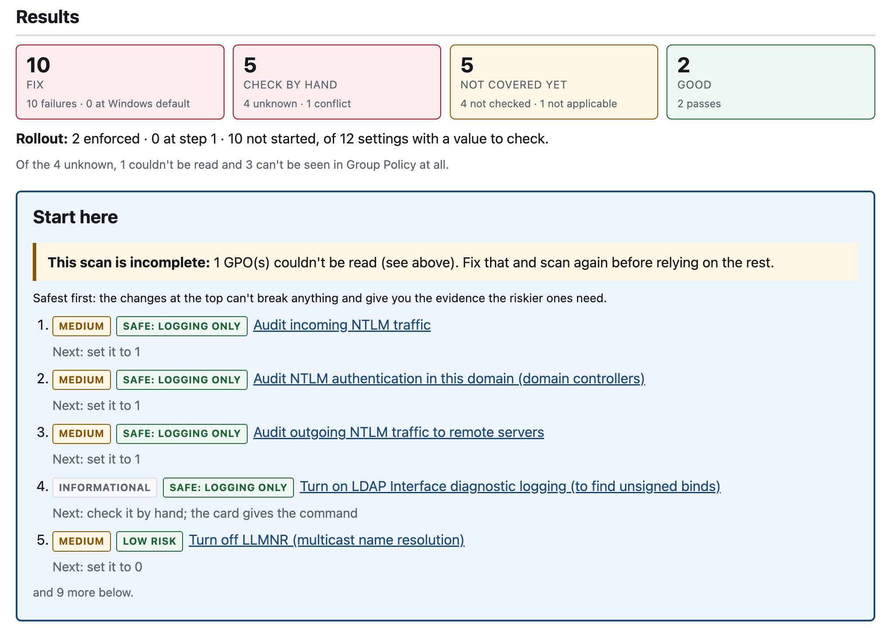

<p align="center">
  
</p>

<h3 align="center">A read-only Active Directory and Group Policy hardening auditor</h3>

<p align="center">
  <a href="https://github.com/alexlinos/ADitor/releases/latest"></a>
  <a href="https://github.com/alexlinos/ADitor/actions/workflows/windows-build.yml"></a>
  <a href="LICENSE"></a>
  
</p>

<p align="center">
  <a href="https://github.com/alexlinos/ADitor/releases/latest"><b>Download for Windows</b></a> ·
  <a href="https://alexlinos.github.io/ADitor/examples/hardening-report-sample.html">Sample report</a> ·
  <a href="docs/HARDENING_CATALOG.md">Control catalog</a> ·
  <a href="SECURITY.md">Security</a>
</p>

---

ADitor reads a domain's Group Policy over LDAP and SYSVOL, checks it against a
versioned catalog of hardening controls, and writes a report you can hand to
someone. Run it again next month and diff the two scans to see what your fixes
changed and whether anything regressed. It never writes to the directory.

ADitor doesn't replace [PingCastle](https://www.pingcastle.com/) or
[Purple Knight](https://www.purple-knight.com/). Use them for a broad
assessment of your Active Directory security. ADitor complements them for the
hardening work that follows: it checks specific Group Policy and directory
settings against a catalog of sourced controls, tells you what order to change
them in, and compares scans so you can see what each change did.

<p align="center">
  
  <br><sub>From the <a href="https://alexlinos.github.io/ADitor/examples/hardening-report-sample.html">sample report</a>, rendered from synthetic data.</sub>
</p>

## What it touches

- **Reads only.** LDAP searches and SMB reads of SYSVOL. ADitor sends no
  modify, add or delete to the directory, and writes nothing to SYSVOL.
- **A read-only account is enough.** An ordinary domain user can normally read
  everything it checks, so it doesn't need Domain Admin. Anything it can't read
  is reported as unreadable, never as a pass.
- **Nothing leaves the machine.** No telemetry and no update checks. The report
  is written locally and loads nothing from the network. The only other
  connection it makes is the optional issuing-CA download, which fetches a
  public certificate from the URL printed in your DC's certificate and sends no
  credential.
- **The output is sensitive.** `scan.json` and `report.html` contain GPO names,
  registry values and DNs from your domain.

## Download

Windows builds are on the [Releases](https://github.com/alexlinos/ADitor/releases)
page:

- `ADitor.exe`: the desktop app. It needs WebView2, which is already on
  Windows 10 and 11.
- `aditor-cli.exe`: the command line, for scheduled tasks and Server Core.
- `SHA256SUMS.txt`: checksums. Check one with
  `Get-FileHash .\ADitor.exe -Algorithm SHA256` in PowerShell.

The executables are not code-signed yet, so Windows SmartScreen will warn the
first time you run one (**More info → Run anyway**). If that's a problem where
you work, build from source instead (below).

See the [code signing policy](#code-signing-policy) for how releases are signed.

## Requirements

The Windows downloads carry their own Python, so there's nothing else to
install. You need:

- **64-bit Windows:** Windows 10 or 11, or Windows Server 2016 or later. The
  command line is also tested on Server Core. The desktop app needs WebView2,
  which Windows 10 and 11 already have and Server Core doesn't.
- **Network access to a domain controller:** LDAPS on TCP 636 (or LDAP on 389,
  which sends the password in clear text), and SMB on TCP 445 to read SYSVOL.
- **A domain account to bind with.** An ordinary domain user is enough. It
  doesn't need admin rights.

## Installing from source

For macOS or Linux, or if you'd rather not run an unsigned executable. This
needs Python 3.12 and [uv](https://github.com/astral-sh/uv) (or pip).

```bash
git clone https://github.com/alexlinos/ADitor.git
cd ADitor

uv venv --python 3.12
source .venv/bin/activate

uv pip install -e ".[smb]"          # add ,gui for the desktop app
```

## Configuration

```bash
cp ad-config/config.example.json ad-config/config.json
chmod 600 ad-config/config.json
```

```json
{
  "active_directory": {
    "server": "ldaps://dc.example.com:636",
    "domain": "example.com",
    "base_dn": "DC=example,DC=com",
    "bind_dn": "EXAMPLE\\svc-aditor",
    "password": "${AD_MCP_PASSWORD}"
  },
  "security": {
    "validate_certificate": true
  }
}
```

Use `ldaps://` (port 636). ADitor binds with a simple bind and doesn't use
STARTTLS, so with plain `ldap://` the bind password crosses the network in clear
text; ADitor allows it but warns every time.

The `password` field supports `${ENV_VAR}` expansion, so the secret can be supplied
at runtime rather than stored on disk. If it is unset and you run `aditor scan`
from a terminal, you are prompted for it. `config.json` is gitignored.

On macOS, [`scan_keychain.sh`](scan_keychain.sh) pulls the password from the
Keychain (service `admcp-ldap`) and runs a scan with it.

## Usage

With the Windows download, use `aditor-cli.exe` wherever this says `aditor`,
for example `.\aditor-cli.exe scan --config config.json --out C:\scans`.

```bash
aditor scan --config ad-config/config.json --out ~/scans
aditor diff ~/scans/2026-08-20T193156Z-26f204f6 ~/scans/2026-08-24T184004Z-9d7d8ba2
```

| Exit code | Meaning |
|---|---|
| 0 | Nothing needs attention |
| 1 | The scan has a `fail` or `error` finding, or the diff has a regression |
| 2 | The command could not run (config, connection, or a refused file); nothing was written |

The exit codes let it run unattended from a scheduled task or an RMM agent.

### `aditor scan`

Runs the scan **once** and writes one dated folder:

```
<out>/2026-08-20T162647Z-b288e925/
    scan.json      <- the payload (source of truth)
    report.html    <- the rendered document
```

Both files come from the same scan, so they carry the same `scan_id`,
timestamp and findings. The folder name is the scan's own timestamp plus a
`scan_id` prefix, with no colon so it is legal on Windows. An existing folder is
never overwritten, and a failed write leaves no folder behind.

Each finding carries a result, a rollout state (not started / audit / enforced,
so a domain correctly mid-rollout does not read as failing), and evidence: the
expected value next to every value found, with the source GPO and its link path.
Controls come from the Devore AD Hardening Series, and each one cites its
article. Most read Group Policy; a few read the directory itself (service
accounts without AES, built-in privileged groups that should be empty, and
unconstrained delegation), with read-only LDAP queries. Policy precedence is not resolved: GPOs that disagree are reported as
conflicts. Controls whose exact expected value the source does not state are
reported but never scored or guessed.

The report is one self-contained HTML file (inline CSS, no scripts, no network)
that opens from a `file://` path and prints to PDF from a browser. It opens with
a "Start here" box (where you stand, and the first few things to do) and groups
findings by what you do with them: **Fix**, **Check by hand**, **Not covered
yet** and **Good**. Each finding shows found versus target, the fix and the safe
rollout order up front, with the evidence one click away. A warning about
unreadable GPOs always comes first. See [the sample report](https://alexlinos.github.io/ADitor/examples/hardening-report-sample.html),
rendered from synthetic data.

**Both files contain directory content** — GPO display names, registry values
and DNs. Treat them accordingly when sharing.

### Who still uses NTLMv1?

The scan reads Group Policy, not event logs, so it can't see which machines
and accounts still use NTLMv1. A read-only PowerShell script collects that:

```bash
aditor ntlm-script > export.ps1   # list your DCs and servers in it, then run it
aditor ntlm-check ntlmv1-evidence.csv
aditor scan --config ad-config/config.json --ntlm-evidence ntlmv1-evidence.csv
```

The script reads two sources:

- **Security event 4624:** NTLMv1 logons, on every Windows version.
- **The NTLM operational log:** events 4020–4023 and 4030–4033, on Windows 11
  24H2 and Server 2025.

It writes one CSV, which holds account and machine names. Run it as a member of
Event Log Readers on each host; it doesn't need Domain Admin.

NTLMv1 is logged on the server being signed in to, so include every server, not
just the domain controllers. ADitor only calls it clear when every host's logs
cover 14 days with logon auditing on. An empty list on its own proves nothing.

### `aditor diff OLD NEW`

Compares two scans, given as `scan.json` files or snapshot folders. It reads two
files and touches no directory.

It says first whether a difference is **the domain's** or **the tool's**. If
the two scans ran different catalog or engine versions, every difference may be
the scanner rather than the domain, and the diff says so before anything else.
This is not hypothetical: one control here went `fail` → `pass` between two real
scans only because the scanner learned to read Group Policy Preferences.

Regressions are listed before improvements. A rollout moving backwards
(`enforced` → `audit`) counts as a regression even when the result stays `pass`.
A control added to or removed from the catalog is never counted as either.

## The desktop app

For an administrator who would rather not use a terminal. On Windows, run
`ADitor.exe`. From source:

```bash
uv pip install -e ".[gui,smb]"
python -m aditor.app
```

| Screen | What it does |
|---|---|
| **Connection** | Enter and test read-only credentials. On failure it shows the *actual* LDAP error, and helps establish LDAPS certificate trust. |
| **Scan** | One button. Runs the same scan as `aditor scan`, shows its progress and counts, and opens the report. |
| **History** | The snapshot archive. Open a report, or pick two scans and diff them, with an ambiguous attribution shown as a warning. |

**Credentials.** The bind password is never written to disk. It goes to the OS
credential store — Windows Credential Manager or the macOS Keychain, under the
same `admcp-ldap` service name `scan_keychain.sh` uses — and the app's config
file holds the `${AD_MCP_PASSWORD}` placeholder. That file has the same shape
`aditor scan --config` reads. If no OS credential store is available, the app
says so and refuses to save.

`pywebview` is an optional extra (`gui`); the `aditor` command installs and runs
without it.

## Running it on a domain controller

It works, but run it from an admin workstation where you can. A DC is a Tier 0
host, and ADitor is an unsigned new executable that only needs a read-only
account and network access to a DC. If you do run it on one:

- Server Core has no WebView2, so the desktop app won't open; use
  `aditor-cli.exe`.
- Saving a connection in the desktop app stores the bind password in that
  machine's Credential Manager. On a DC, prefer `aditor-cli.exe` with the
  password supplied at run time.

The certificate helper's **Download the issuing CA certificate** works well on a
DC: it looks in the machine's own certificate stores first, and it never sends
a credential to find the file.

## Development

```bash
pytest
```

```
src/aditor/
  cli.py               # the aditor command: scan, diff
  hardening/           # catalog, collection, evaluator, report, snapshot, diff
  gpo/                 # pure GPO parsers (Registry.pol, GptTmpl.inf, Registry.xml)
  core/                # LDAP connection manager, logging
  config/              # configuration models and loader
  app/                 # the desktop app
tests/
docs/                  # design docs and the hardening control catalog
```

## Contributing

Issues and pull requests are welcome. Every pull request runs the test suite on
Windows. A new control goes in `src/aditor/hardening/controls.json`, with a
source for its expected value and a test that fails without it.

Don't put real domain data in an issue, a test fixture or a screenshot. Use
`example.com` and made-up names. To report a vulnerability, see
[SECURITY.md](SECURITY.md).

## Code signing policy

Free code signing provided by [SignPath.io](https://about.signpath.io/),
certificate by [SignPath Foundation](https://signpath.org/).

Signing starts with the first release after SignPath approves the project.
Until then, the downloads are unsigned.

Only the executables built from this repository by its GitHub Actions workflow
are signed, and only for a tagged release.

| Role | Who |
|---|---|
| Committers and reviewers | [Alex Linos](https://github.com/alexlinos) |
| Approvers | [Alex Linos](https://github.com/alexlinos) |

**Privacy.** This program will not transfer any information to other networked
systems unless specifically requested by the user or the person installing or
operating it. ADitor connects only to the domain controller you configure and,
if you choose **Download the issuing CA certificate**, to the certificate URL
printed in that domain controller's certificate. See
[What it touches](#what-it-touches).

## License

MIT, see [LICENSE](LICENSE). ADitor began as a fork of
[ActiveDirectoryMCP](https://github.com/alpadalar/ActiveDirectoryMCP) by Alperen
Adalar (MIT), whose copyright is kept in the license file. The MCP server and
its directory-management tools were removed.

---

Copyright © 2026 Alex Linos.
